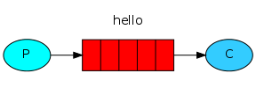
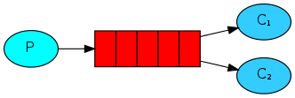
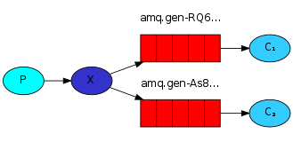
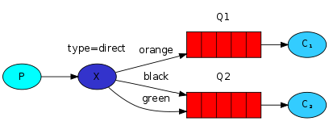
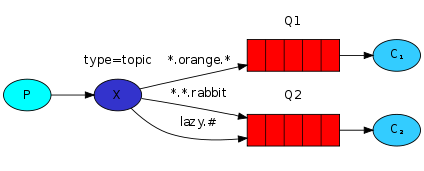

## Enterprise Integration Patterns Demo - Introduction to Messaging Patterns
=========================================================================

### Requirements
1. python 2.7+
2. Install pip: `sudo easy_install pip`
3. Install virtualenv: `pip install virtualenv`
4. Install virtualenvwrapper: `pip install virtualenvwrapper`
5. Install Rabbit MQ Server [Mac Distro](https://www.rabbitmq.com/download.html)


### Get environment Set-up
1. Create Your Virtual Environment<br/>
```
$ mkvirtualenv eip_demo
```
<br/>

2. Activate virtual environment<br/>
```
$ workon eip_demo
```
<br/>

3. Install requirements <br/>
```
$ cd eip_demp
```
<br/>
```
$ pip install -r requirements.txt 
```
<br/>

4. Start rabbitmq in a new window<br/>
```
$ rabbitmq-server
```

### A few commands
1. Access RabitMQ Admin UI: 
1. Shutdown RabbitMQ Server: `Ctrl+C` in server window then `k`
1. Exit Virtual env `deactivate eip_demo`

### The Examples
1) <b>Simple Send/Receive</b><br/>



<p>Producer sends messages to the "hello" queue. The consumer receives messages from that queue.</p>

2) <b>Work Queue</b><br/>




<p>The main idea behind Work Queues (aka: Task Queues) is to avoid doing a resource-intensive task immediately and 
having to wait for it to complete. Instead we schedule the task to be done later. We encapsulate a task as a message 
and send it to the queue. A worker process running in the background will pop the tasks and eventually execute the job. 
When you run many workers the tasks will be shared between them. </p>

3) <b>Publish-Subscribe</b><br/>



<p>Deliver a message to multiple consumers registered on a particular channel. 
This pattern is known as "publish/subscribe".</p>

4) <b>Content Based Routing</b><br/>



<p>Route messages to the appropriate Message Queue based on message identifier (routing key).</p>


5) <b>Topic Based Exchanges/Queues</b> <br/>



<p>Route messages based on complex routing key allowing for wild cards (* 1 wild card word, # 0 or more wild-card words) 
This pattern can have the specificity of a direct, point-to-point channel or also function like a pub-sub channel or both, 
depending on how queue’s are configured on the channel.</p>


### Running Examples
 See notes and comments in respective client/server files. 

### Additional Reference Materials

#### [RabbitMQ Documentation](https://www.rabbitmq.com/documentation.html) 
#### [Kombu](http://kombu.readthedocs.org/en/latest/introduction.html#installation)
#### [AMQP Reference](https://www.rabbitmq.com/amqp-0-9-1-quickref.html)
#### [EIP Book](http://www.amazon.com/Enterprise-Integration-Patterns-Designing-Deploying/dp/0321200683/ref=sr_1_1?s=books&ie=UTF8&qid=1412347007&sr=1-1&keywords=enterprise+integration+patterns)
#### [EIP Refrence](http://www.eaipatterns.com/index.html)
#### More Tutorials/Examples 
#### [RabbitMQ](https://www.rabbitmq.com/getstarted.html)
#### [Kombu](http://kombu.readthedocs.org/en/latest/userguide/examples.html)
<br/>
<br/>

